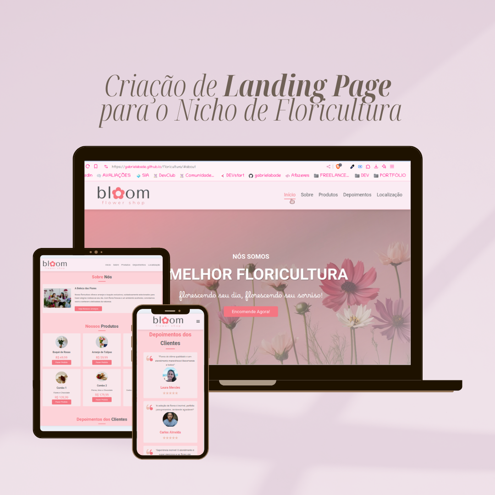

# Landing Page - Floricultura Bloom

 O site foi projetado para oferecer uma experiência interativa, permitindo aos usuários explorar a floricultura, conhecer produtos, ler depoimentos e encontrar a localização com facilidade.

## Funcionalidades

- **Página inicial**: Apresenta o conceito da floricultura e um botão para realizar pedidos.
- **Sobre Nós**: Seção dedicada a apresentar a missão da floricultura, com imagem e descrição.
- **Produtos**: Galeria com opções de arranjos, buquês e combom, preços e link para pedidos diretos via WhatsApp.
- **Depoimentos**: Exibe opiniões de clientes satisfeitos, criando uma conexão de confiança.
- **Localização**: Mapa interativo do Google Maps para encontrar a floricultura com facilidade.
- **Redes Sociais**: Ícones de redes sociais e contato direto, para fácil acesso aos canais da floricultura.

## Tecnologias Utilizadas

- **HTML**
- **CSS**
- **JavaScript**

## Como Visualizar
Você pode ver a aplicação online [aqui](https://gabrielabade.github.io/floricultura/)
